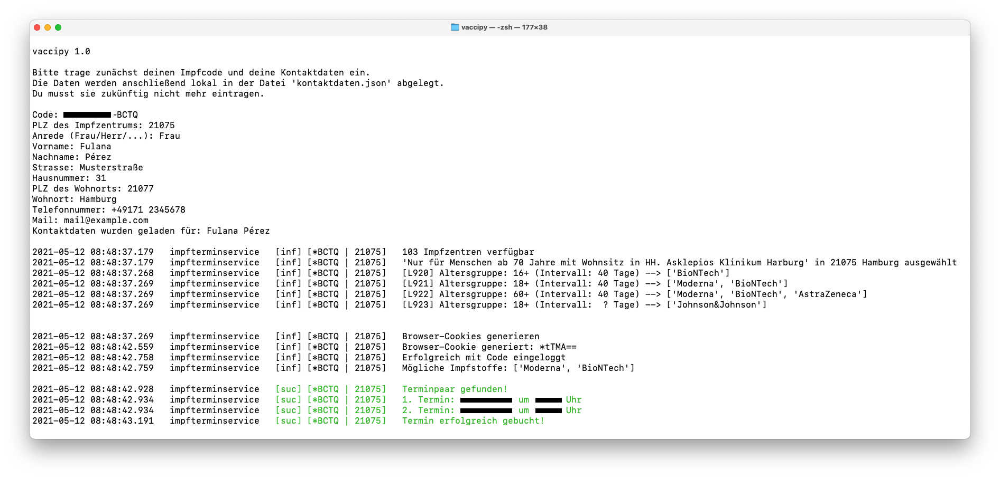

# vaccipy
[](https://github.com/iamnotturner/vaccipy/actions/workflows/build_windows.yaml)

Automatisierte Impfterminbuchung auf [www.impfterminservice.de](https://www.impfterminservice.de/).

<a href="https://download-directory.github.io/?url=https%3A%2F%2Fgithub.com%2Fiamnotturner%2Fvaccipy%2Ftree%2Fmaster%2Fdist%2Fwindows-terminservice">

</a>

## Ausgangssituation

Unsere Großeltern möchten sich gerne impfen lassen, aber telefonsich unter 116117 kommen sie nicht durch und das Internet
ist auch noch immer irgendwie Neuland. Jetzt kommt es zum Konflikt: einerseits möchte man natürlich gerne bei der Terminbuchung helfen,
andererseits hat man aber auch keine Lust, deshalb nun den ganzen Tag vor dem Computer zu hocken und die Seite zu aktualisieren...

## Wie funktioniert vaccipy?


Zunächst trägst du deinen "Impf-Code" (*Beispiel: A1B2-C3D4-E5F6*), die PLZ deines Impfzentrums 
und deine Daten (Anschrift, Telefon, Mail) ein, die bei der Terminbuchung angegeben werden sollen.
Du wirst zur Eingabe aufgefordert und deine Daten werden in der Datei `./kontaktdaten.json` gespeichert.

*Hinweis: Es kann sein, dass für mehrere Impfzentren unterschiedliche Codes benötigt werden (mehr Infos: [Auflistung der gruppierten Impfzentren](impfzentren_gruppiert.md)).*

Anschließend passiert alles automatisch: `vaccipy` checkt für dich minütlich, ob ein Termin verfügbar ist 
und **bucht ~~den erstbeste~~ einen zufälligen**.

## Workflow


`vaccipy` nutzt die selben Endpunkte zur Terminbuchung, wie dein Browser.

1) Abruf aller Impfzentren und abgleich, ob für die eingetragene PLZ ein Impfzentrum existiert
2) Abruf der Impfstoffe, die im gewählten Impfzentrum verfügbar sind

Zur Terminbuchung werden Cookies benötigt (`bm_sz`), die im Browser automatisch erzeugt werden.
Damit wir diese auch im Script haben, wird zu Beginn eine Chrome-Instanz (im Prinzip ein separates Chrome-Fenster)
geöffnet und eine Unterseite des [Impfterminservices](https://www.impfterminservice.de/) aufgerufen.
Anschließend werden die Cookies extrahiert und im Script aufgenommen.

3) Cookies abrufen
4) Mit dem Code "einloggen", im Browser ist das der Schritt: Impfzentrum auswählen und den Code eintragen

Die nachkommenden Schritte erfolgen im Loop. Es werden minütlich verfügbare Termine abgerufen und, 
sollten Termine verfügbar sein, ~~der erstbeste~~ ein zufälliger ausgewählt. Dieser Prozess kann eine längere Zeit dauern und 
die Cookies laufen irgendwann ab (entweder alle 10 Minuten oder nach 5-6 Anfragen). Sobald die Cookies abgelaufen
sind, wird wieder ein Chrome-Fenster geöffnet und neue Cookies erstellt.

5) Termine abrufen: Wenn Termine verfügbar sind, springe zu *Schritt 8*
   

6) Eine Minute warten **oder**
7) (bei Ablauf) Cookies erneuern 

Wenn ein Termin verfügbar ist, wird dieser mit den eingetragenen Daten gebucht.

**Achtung! Im nächsten Schritt wird ein verbindlicher Impftermin gebucht!**

8) Buchen des Impftermins


## Termin gebucht, was nun?

Nachdem dein Termin erfolgreich gebucht wurde, erhälst du eine Mail, in der du zunächst deine 
Mail-Adresse bestätigen musst. Nachdem du die Mail bestätigt hast, erhälst du zu jedem Termin 
eine Buchungsbestätigung. That's it!

## Programmdurchlauf



## Requirements

* Python 3 (getestet mit Python 3.9)
* pip (zur Installation der Python-Module, getestet mit pip3)

Die notwendigen Python-Module können mittels pip installiert werden.

```shell    
pip3 install -r requirements.txt
```

`vaccipy` kann über die Kommandozeile oder in einer beliebigen python-Entwicklungsumgebung
ausgeführt werden:

```shell
python3 main.py
```

## Distributionen

Für eine bessere Nutzererfahrung erstellen wir verschiedene Distributionen, die ohne installation von Python direkt ausgeführt werden können. 
Die Unterfolder von `dist/` sind jeweils Distributionen die geteilt werden können und eigenständig funktionieren.

Zum Ausführen des Programms, einfach die passende Distribution (basierend auf dem eigenen Betriebssysstem) auswählen und die folgende Datei ausführen. 

*Hinweis: Es wird jeweils immer der gesamte Ordner benötigt!* 


### Download 
Verfügbare Distributionen:
- [x] [Windows](https://download-directory.github.io/?url=https%3A%2F%2Fgithub.com%2Fiamnotturner%2Fvaccipy%2Ftree%2Fmaster%2Fdist%2Fwindows-terminservice) 
- [ ] MacOS Intel
- [ ] MacOS M1 
- [ ] Linux 

**Ausführung Windows:** 
- .zip Ordner entpacken
- Im `windows-terminservice\`-Ordner die `windows-terminservice.exe` ausführen. 


Für mehr Info zum Verteilen und Erstellen der Distributionen: [Shipping](#Shipping)

## Shipping
### Workflows
Um den Buildprozess zu vereinfachen gibt es verschiedene Buildpipelines, welche bei push Events in den Masterbranch ausgeführt werden.   
Die pipelines sind im `.github/workflows` Ordner zu finden. 

Aktuelle Pipelines:
- [x] [Windows Build-Pipeline](https://github.com/iamnotturner/vaccipy/actions/workflows/build_windows.yaml)

### Generell

Zum Erstellen der Distributionen wird [pyinstaller](https://pyinstaller.readthedocs.io/en/stable/index.html) verwendet.  
Schritte zum Erstellen einer Distribution: 
- Erstelle eine .spec Datei für die main.py (einmalig)
- Erstelle die Distribution basierend auf der erstellten .spec Datei:
    ```shell
    pyinstaller --clean specs/SPECNAME.spec
    ```
    Nachdem mit pyinstaller die Distribution erstellt wurde, ist diese in im `dist/` folder zu finden.  


### Windows

.spec Datei erstellen und anschließend Distribution erstellen:
```shell
pyi-makespec main.py --specpath "specs//" --add-binary "..\tools\chromedriver\chromedriver-windows.exe;tools\chromedriver\" --name windows-terminservice --hidden-import plyer.platforms.win.notification

pyinstaller --clean specs/windows-terminservice.spec
```     

### Resources
- [pyinstaller docs](https://pyinstaller.readthedocs.io/en/stable/index.html)

## Das könnte noch kommen

Es gibt noch ein paar Features, die cool wären. Die Ideen werden hier mal gesammelt und
werden (von uns oder euch - feel free!) irgendwann hinzukommen:

- [ ] Datum eingrenzen bei der Terminwahl
- [ ] Macosx Build / Pipeline
- [ ] Linux Build / Pipeline
- [ ] Raspi support
- [ ] Code Zertifikate für Windows

## Das kann vaccipy NICHT - und wird es auch nie können

`vaccipy` dient lediglich als Unterstützung bei der Impftermin-Buchung **EINER EINZELNEN PERSON**,
weshalb folgende Automatisierungen und Erweiterungen **NICHT** kommen werden:

* Erstellung des Impf-Codes
* Filterung der verfügbaren Termine nach Impfstoff
* Möglichkeit zum Eintragen mehrerer Impf-Codes und Kontaktdaten
* Headless Selenium Support


## Bedanken?

<a href="https://www.aerzte-ohne-grenzen.de/spenden-sammeln?cfd=pjs3m">

</a>
.. musst du dich nicht. Es freut uns sehr, wenn wir dir die Terminsuche etwas erleichtern konnten. 

Für den Fall, dass du dein Dank gerne in Geld ausdrücken möchtest, haben wir [hier eine Spendenaktion](https://www.aerzte-ohne-grenzen.de/spenden-sammeln?cfd=pjs3m) eingerichtet. [ÄRZTE OHNE GRENZEN](www.aerzte-ohne-grenzen.de) leistet weltweit medizinische Nothilfe in Krisen- und Kriegsgebieten und nach Naturkatastrophen.

Es wäre mega cool, wenn du dich daran beteiligst - ist aber vollkommen freiwillig, also no pressure 😉

# Seid vernünftig und missbraucht das Tool nicht.
save da world. my final message. goodbye.
